# Multilayer-Perceptron

```diff
- The project is still ongoing. I do daily updates into the contents.
```

## 1. Project overview

The project is part of my studying at [Hive (Helsinki) Coding School](https://hive.fi). Programs are written in C-, and python- languages. An additional visualization (Bonus part of the project) I used Influxdb and Grafana which are running inside a docker container. For visualization I used Jupyter notebook. The picture below visualizes a general overview of a curriculum (Holy Graph) and my progress at Hive Coding School.

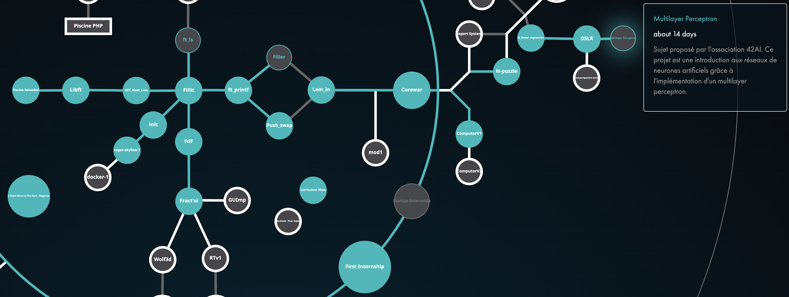

## 2. Project description

**Note.** Text into this chapter (project description) was copied (partly or fully) from Hive Coding School document.

### 2.1 Introduction

In the language of your choice you are going to implement a multilayer perceptron, in order to predict whether a cancer is malignant or benign on a dataset of breast cancer diagnosis in the Wisconsin.

### 2.2 Mandatory part

#### 2.2.1 Foreword

A non-negligible part of the evaluation will be based on your understanding of the training phase (also called the learning phase) and the underlying algorithms. You will be asked to explain to your corrector the notions of feedforward, backpropagation and gradient descent. Points will be attributed depending on the clarity of your explanations. These notions are important for the next projects of the branch and will represent a real asset if you wish to continue in this field.

#### 2.2.2 Dataset

The dataset is provided in the resources. It is a csv file of 32 columns, the column diagnosis being the label you want to learn given all the other features of an example, it can be either the value M or B (for malignant or benign). The features of the dataset describe the characteristics of a cell nucleus of breast mass extracted with [fine-needle aspiration](https://en.wikipedia.org/wiki/Fine-needle_aspiration). (for more detailed informations, go [here](https://archive.ics.uci.edu/ml/machine-learning-databases/breast-cancer-wisconsin/wdbc.names)). As you will see, there is an important work of data understanding before starting to implement the algorithm which will be able to classify it. A good practice would be to begin by playing with the dataset by displaying it with graphs, visualizing and manipulating its different features.

#### 2.2.3 Implementation

Your implementation of the neural network must contain at least two hidden layers (the idea is to make you write a program a bit more modular. Although this won’t be graded, it still is a good habit to take). You must also implement the softmax function on the output layer in order to obtain the output as a probabilistic distribution. In order to evaluate the performances of your model in a robust way during training, you will split your dataset in two parts, one for the training, and one for the validation (the validation dataset is used to determine the accuracy of your model on unknown examples).
To visualize your model performances during training, you will display at each epoch
the training and validation metrics, for example :

```text
    epoch 39/70 - loss: 0.0750 - val_loss: 0.0406
    epoch 40/70 - loss: 0.0749 - val_loss: 0.0404
    epoch 41/70 - loss: 0.0747 - val_loss: 0.0403
```

You will also implement a learning curve graph displayed at the end of the training phase (you are free to use any library you want for this purpose).

#### 2.2.4 Submission

You will submit two programs, the first for the training phase, and the second for the prediction phase (or you can submit a single program with an option to switch between the two phases) :
• The training program will use backpropagation and gradient descent to learn on the training dataset and will save the model (network topology and weights) at the end of its execution.
• The prediction program will load the weights learned in the previous phase, perform a prediction on a given set (which will also be loaded), then evaluate it using the binary [cross-entropy error function](https://en.wikipedia.org/wiki/Cross_entropy#Cross-entropy_error_function_and_logistic_regression):

+(1-y_{n})log(1-p_{n})])

## 3. Solution

## 3.1 Exploratory data analysis

The aim of this chapter is to give an overview of the dataset content

## 3.1.1 Aggregate functions

Based on the result I did these observations:

- The Count function shows that the examples (rows in the dataset) includes data for all columns
- Mode functio is missing from the list. I think that is not big issue. That because of all columns includes values so no reason to add any missing values.
- Fo some reason (maybe a lack of competence) I cannot sey much more about these numbers

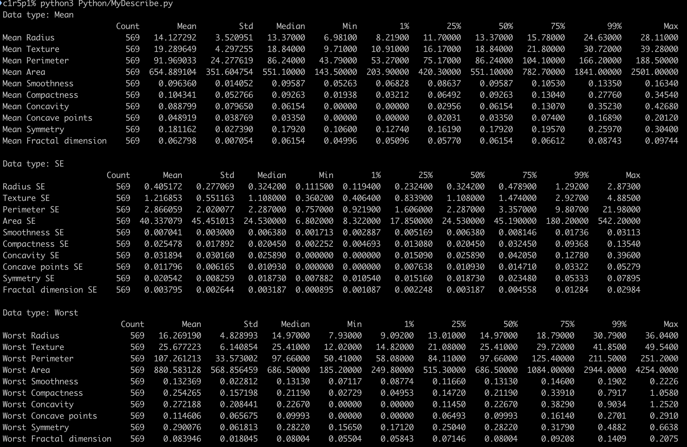

## 3.1.2 Histogram

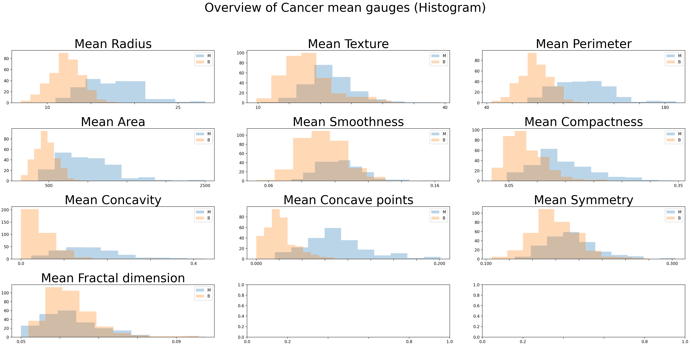

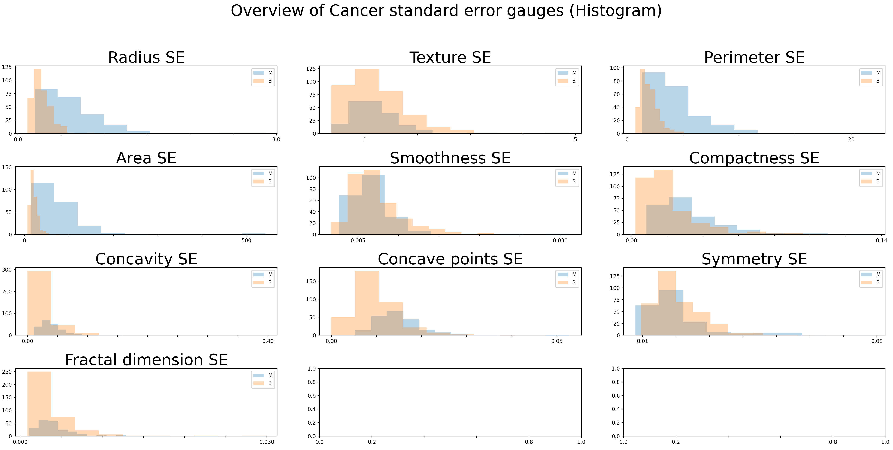

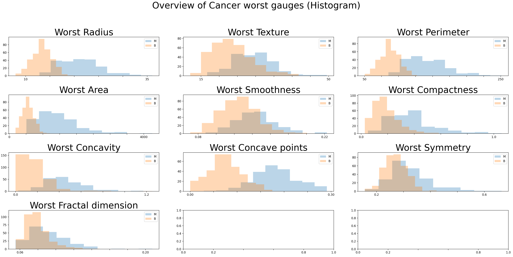

## 3.1.3 Scatter matrix

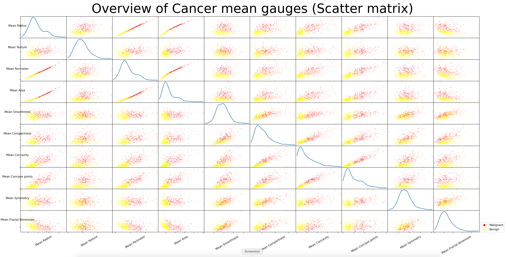


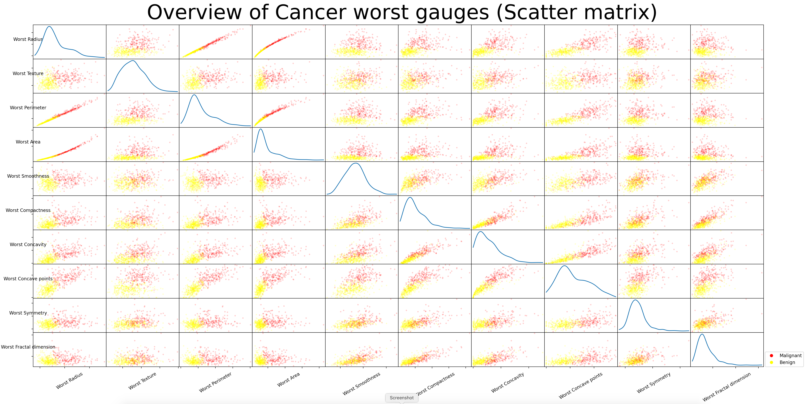

## 3.1.4 Box

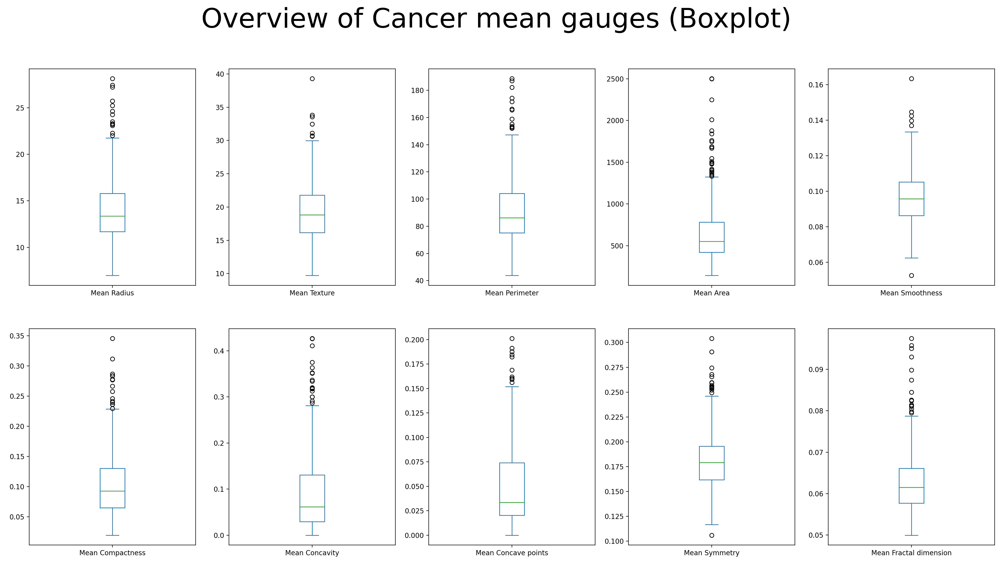

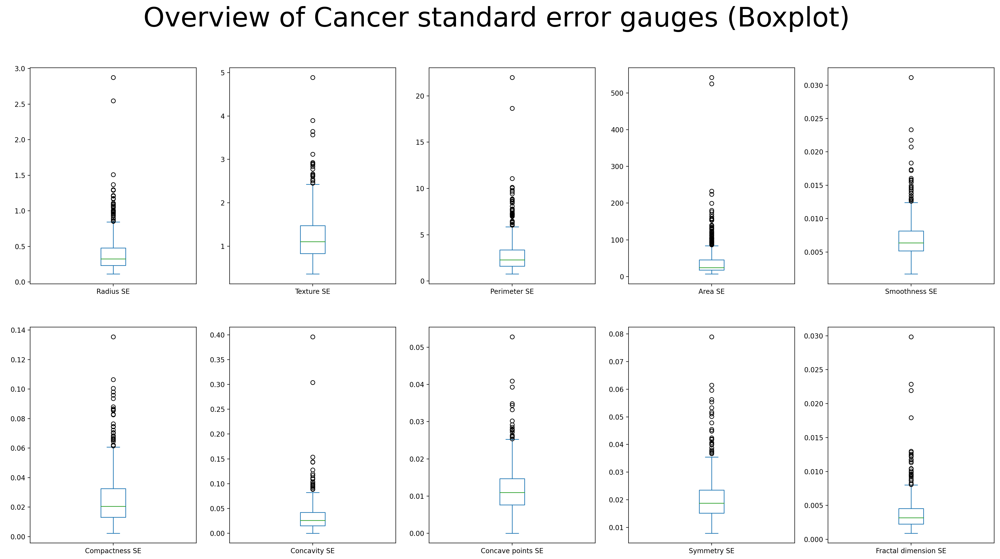

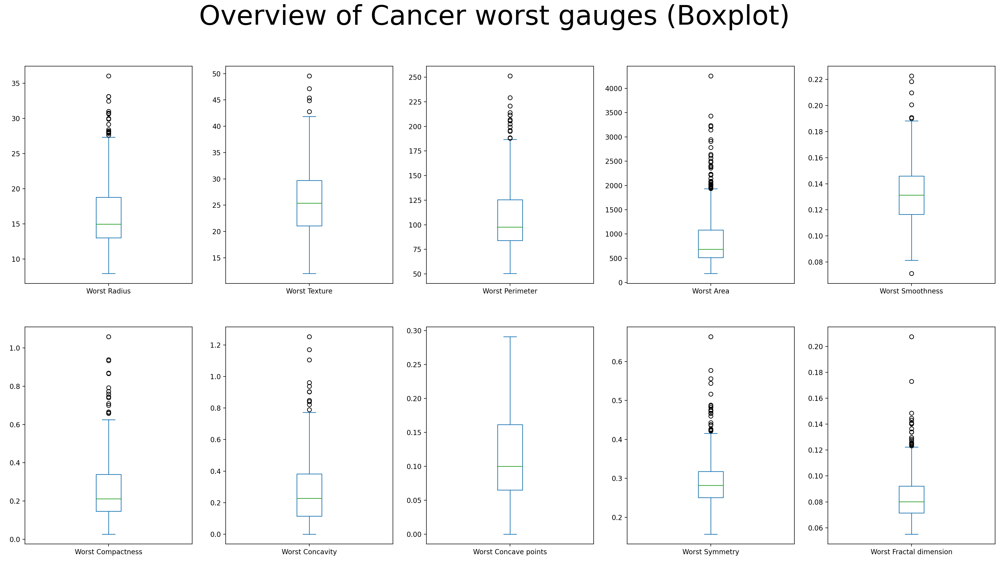

## 3.1.5 Correlation

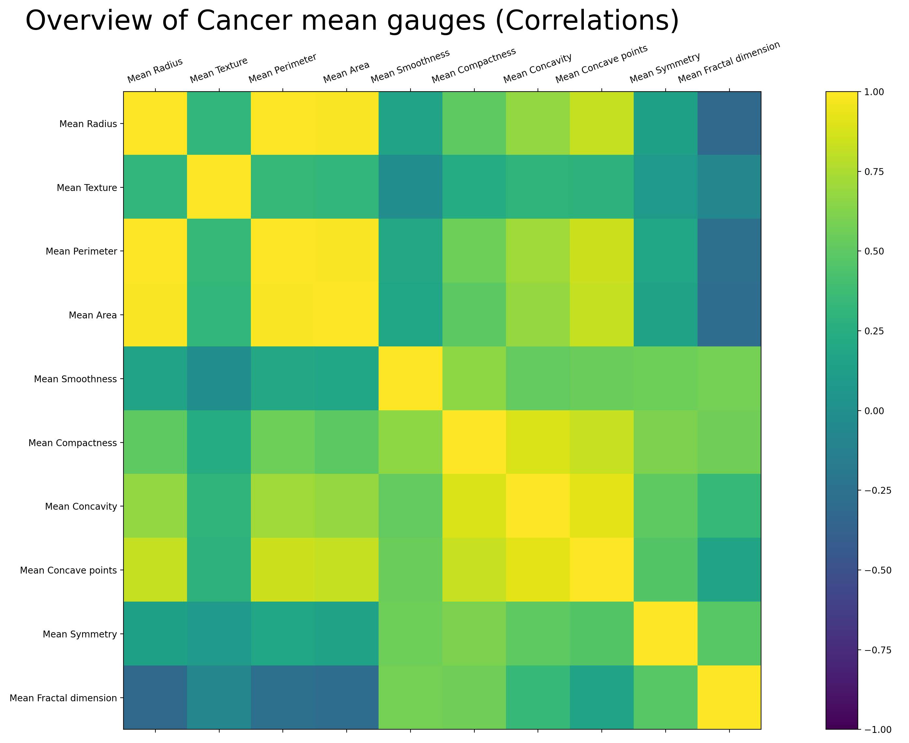

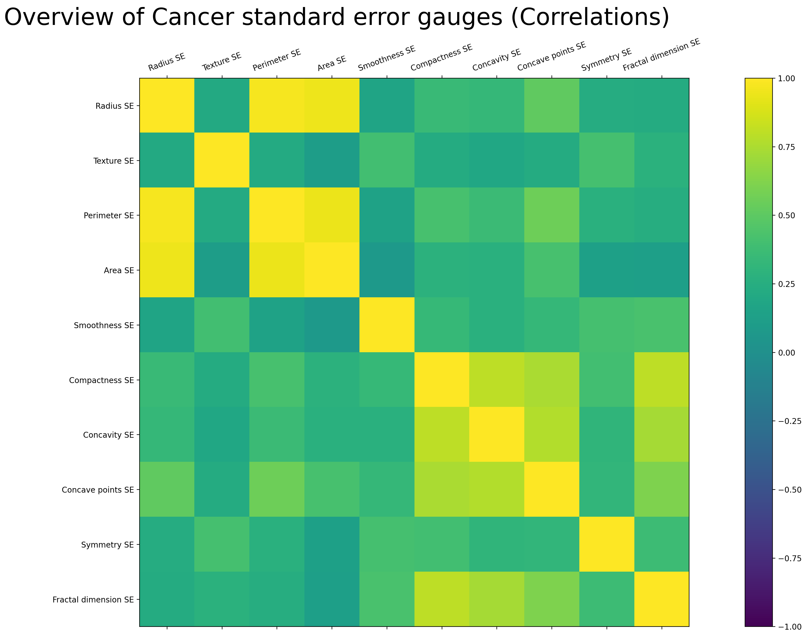

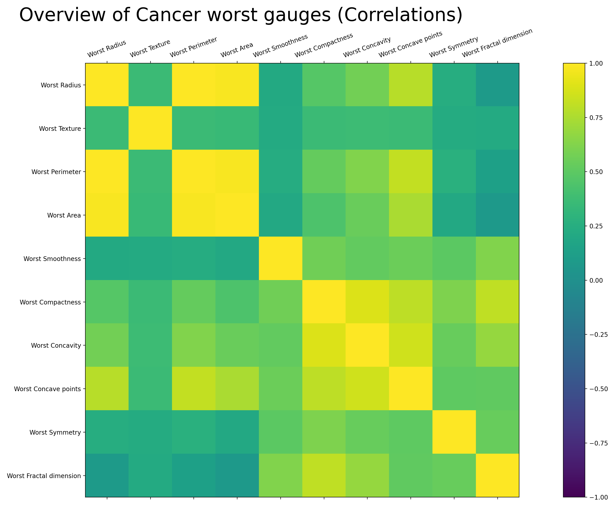
